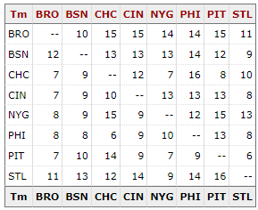

# Sports Reference Engineering Internship Prompt

Please provide us with a coding solution to the following problem. You can use any high-level language that you’d like. This problem shouldn’t take more than an hour to complete. If you are finding yourself spending more time, your solution is probably too elaborate. Submit a link to the location where we can view the code (e.g., github). The solution should contain a README.md that provides an explanation to your solution.

Given a json file that includes each team's Win-Loss records versus opponents, provide a code sample of how you would build a table displaying a matrix of head-to-head records, similar to this table. We are interested in your ability to work with data structures, loops and logic.

Provided json data (Note: The json data provided below is just to give a visualization of the data format. The actual values are unimportant for this exercise and shouldn't need to be included in the code.):

```json
{
  "BRO": {
    "BSN": { "W": 10, "L": 12 },

    "CHC": { "W": 15, "L": 7 },

    "CIN": { "W": 15, "L": 7 },

    "NYG": { "W": 14, "L": 8 },

    "PHI": { "W": 14, "L": 8 },

    "PIT": { "W": 15, "L": 7 },

    "STL": { "W": 11, "L": 11 }
  },

  "BSN": {
    "BRO": { "W": 12, "L": 10 },

    "CHC": { "W": 13, "L": 9 },

    "CIN": { "W": 13, "L": 9 },

    "NYG": { "W": 13, "L": 9 },

    "PHI": { "W": 14, "L": 8 },

    "PIT": { "W": 12, "L": 10 },

    "STL": { "W": 9, "L": 13 }
  },

  "CHC": {
    "BRO": { "W": 7, "L": 15 },

    "BSN": { "W": 9, "L": 13 },

    "CIN": { "W": 12, "L": 10 },

    "NYG": { "W": 7, "L": 15 },

    "PHI": { "W": 16, "L": 6 },

    "PIT": { "W": 8, "L": 14 },

    "STL": { "W": 10, "L": 12 }
  },

  "CIN": {
    "BRO": { "W": 7, "L": 15 },

    "BSN": { "W": 9, "L": 13 },

    "CHC": { "W": 10, "L": 12 },

    "NYG": { "W": 13, "L": 9 },

    "PHI": { "W": 13, "L": 9 },

    "PIT": { "W": 13, "L": 9 },

    "STL": { "W": 8, "L": 14 }
  },

  "NYG": {
    "BRO": { "W": 8, "L": 14 },

    "BSN": { "W": 9, "L": 13 },

    "CHC": { "W": 15, "L": 7 },

    "CIN": { "W": 9, "L": 13 },

    "PHI": { "W": 12, "L": 10 },

    "PIT": { "W": 15, "L": 7 },

    "STL": { "W": 13, "L": 9 }
  },

  "PHI": {
    "BRO": { "W": 8, "L": 14 },

    "BSN": { "W": 8, "L": 14 },

    "CHC": { "W": 6, "L": 16 },

    "CIN": { "W": 9, "L": 13 },

    "NYG": { "W": 10, "L": 12 },

    "PIT": { "W": 13, "L": 9 },

    "STL": { "W": 8, "L": 14 }
  },

  "PIT": {
    "BRO": { "W": 7, "L": 15 },

    "BSN": { "W": 10, "L": 12 },

    "CHC": { "W": 14, "L": 8 },

    "CIN": { "W": 9, "L": 13 },

    "NYG": { "W": 7, "L": 15 },

    "PHI": { "W": 9, "L": 13 },

    "STL": { "W": 6, "L": 16 }
  },

  "STL": {
    "BRO": { "W": 11, "L": 11 },

    "BSN": { "W": 13, "L": 9 },

    "CHC": { "W": 12, "L": 10 },

    "CIN": { "W": 14, "L": 8 },

    "NYG": { "W": 9, "L": 13 },

    "PHI": { "W": 14, "L": 8 },

    "PIT": { "W": 16, "L": 6 }
  }
}
```

### Results should look like:



## Response

> This code creates a table with a header row and multiple team rows in the HTML document. The team names are extracted from a JSON data object and used to create the header rows and team column. The table, row, and cell elements are constructed using `document.createElement()`. The code also creates an additional footer row with the team names. Finally, the constructed table is added to the body of the HTML document.

[👉 View Live Demo](https://cng008.github.io/sports-ref-app/)
